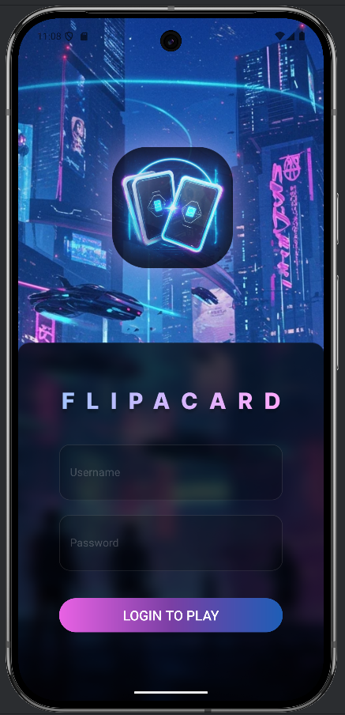

<h1 align="center">🧠 FlipACard: Android Memory Game </h1>
<p align="center">
  
</p>


<p align="center">
  <a href="https://dotnet.microsoft.com/en-us/download" target="_blank" rel="noopener">
    
  </a>
  <a href="https://developer.android.com/studio" target="_blank" rel="noopener">
    
  </a>
  <a href="https://dev.mysql.com/downloads/" target="_blank" rel="noopener">
    
  </a>
  <a href="https://github.com/yourusername/TheMemoryGame/blob/main/LICENSE" target="_blank" rel="noopener">
    
  </a>
</p>


## 📁 Project Structure
```
📂 TheMemoryGame\_Android    → Android game frontend (Kotlin)
📂 TheMemoryGame\_Backend    → ASP.NET Core Web API backend
📄 DummyData.sql            → Sample MySQL data
📄 .gitignore
📄 README.md

```

## ⚙️ Prerequisites

### Android App:
- Android Studio
- Minimum SDK: 24 (Android 7.0)
- Internet connection (for image & advertisement calls)

### Backend:
- [.NET 8 SDK](https://dotnet.microsoft.com/en-us/download)
- [MySQL 8+](https://dev.mysql.com/downloads/)
- Visual Studio 2022+ or VS Code (optional)
- Postman or any API testing tool (optional)


## 🛠️ Setup Instructions

### 1. 🧩 Set up the Backend

1. Open the `TheMemoryGame_Backend` folder.
2. Open `appsettings.json` and **edit the database connection string** under `ConnectionStrings`:

```json
{
  "Logging": {
    "LogLevel": {
      "Default": "Information",
      "Microsoft.AspNetCore": "Warning"
    }
  },
  "AllowedHosts": "*",
  "ConnectionStrings": {
    "DefaultConnection": "server=localhost;database=TheMemoryGame;user=root;password=root;"
  }
}
````

🔧 Replace `server`, `user`, and `password` with your actual MySQL configuration.

3. Import `DummyData.sql` into your MySQL database:

```bash
mysql -u root -p < DummyData.sql
```

4. Run the backend API:

```bash
cd TheMemoryGame_Backend
dotnet run
```

The API should be available at `http://localhost:5178`.


### 2. 📱 Set up the Android App

1. Open `TheMemoryGame_Android` in Android Studio.
2. Ensure the device/emulator has internet access.
3. In `ApiConstants.kt`, update the base URL:

```kotlin
const val BASE_URL = "http://10.0.2.2:5178"
```

⚠️ For **physical devices**, replace `10.0.2.2` with your computer's LAN IP (e.g., `http://192.168.x.x:5178`).  
⚠️ Make sure the port (`5178`) matches with the backend server dotnet console output.

4. Build and run the app.

## 🎮 Game Features

* 🃏 Match card pairs by flipping them
* ⏱️ Countdown timer and match counter
* 🔐 Login system for user sessions
* 🖼️ Fetches card images from [StockSnap.io](https://stocksnap.io)
* 🏆 Leaderboard with top 5 scores and personal rank
* 🔊 Audio feedback and animations
* 📢 Ads displayed based on user type (free/paid)


## 🧪 Sample Test Credentials

```
Username: aung
Password: aung123
```


## 💌 Credits

This project was developed as part of the Android CA coursework by **GDIPSA60 Team 5**.

### Contributors
- [@paulphyo](https://github.com/paulphyo)
- [@haziqjamil1](https://github.com/haziqjamil1)
- [@Ammoe](https://github.com/Ammmoe)
- [@Jinger-ui](https://github.com/Jinger-ui)
- [@coderbang-bang](https://github.com/coderbang-bang)
- [@Carry-Rui](https://github.com/Carry-Rui)


### Special Thanks
- Our instructors for their guidance  
- Open source communities whose tools and libraries we utilized  


© 2025 The Memory Game CA Project

